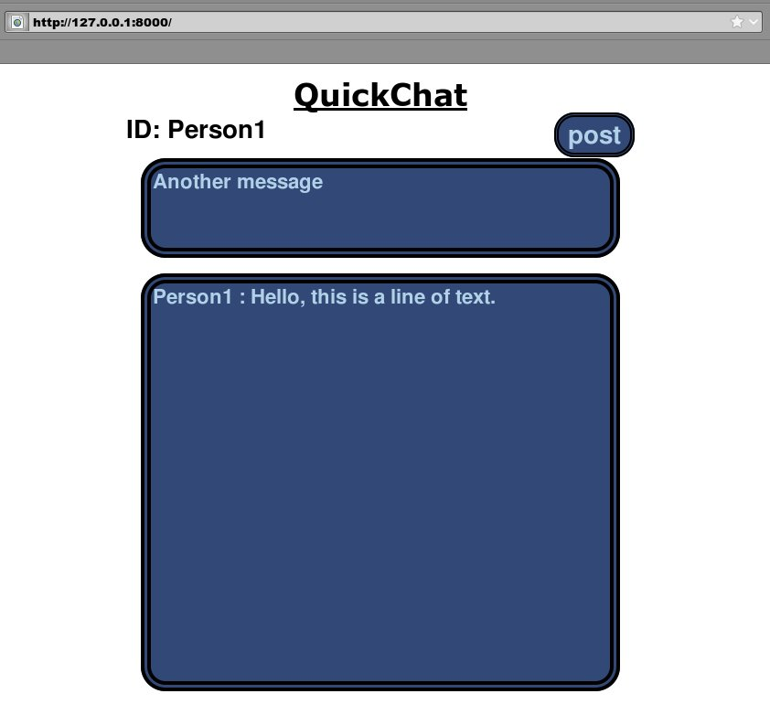

This is a very simple chat server created using node.js.
## Running server: 
- Command: "node server.js"
- Listens for clients on port 8000

## Connecting to server:
- Open browser
- URL: "http://ServerIPAddress:8000/"

